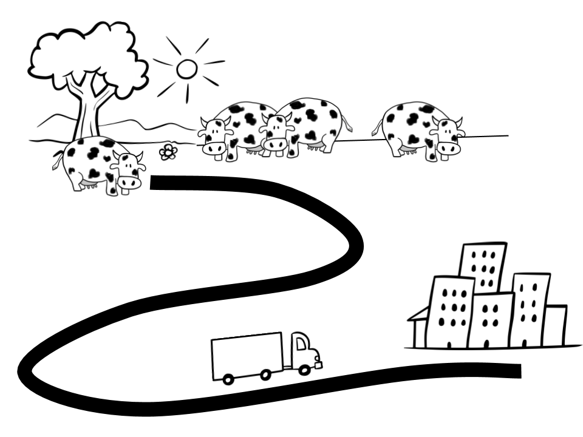

# Les vaques lleteres

Un pagès creu que com que s'estan posant de moda els productes de proximitat ha de portar les seves vaques a la ciutat per vendre més (i més car). Seran de més proximitat si en comptes de portar la llet s'hi porta les vaques, no?

Per portar les vaques a la ciutat ha llogat un camió. Com sap tothom els camions poden portar una càrrega màxima i per tant pot ser que no hi càpiguen totes les vaques.

L'objectiu serà triar les vaques que ha de portar en el camió de manera que es pugui fer el màxim de producció de llet amb un sol viatge.

Ja ha dissenyat les classes:

Condicions:

- Cada vaca és d'una sola Raça
- La llet que fa una vaca depèn del seu pès i de la raça que és
- Pot ser que no sempre faci servir el mateix camió de manera que s'ha de poder personalitzar
- Ha descobert que les vaques quan criden fan un "Mu" per cada quilogram de pès
